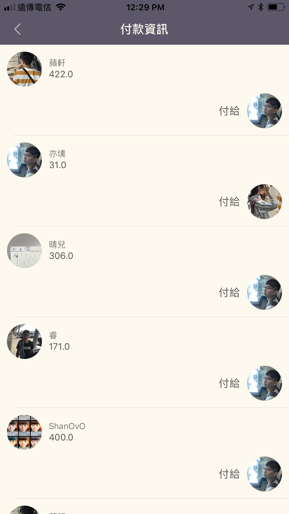

# Padi

Padi is a tool to help you share pays with your friends online. 

Padi is now available in APP Store. 🍻

## 🌟 Features

- [x] Beautiful UI.
- [x] Share with Friends in Real Time.
- [x] Notification Available.
- [x] Two Login methods supported: Email Verification/Account and password.
- [x] Upload Your Event Image.

### 📋 Supported OS & SDK Versions

* iOS 9.0+
* Swift 4 

## 👀 Preview

Padi is built by three entities: event, payment and member.

### EventOverview

### SingleEventView

### SinglePaymentView

### ResultView

### Settings

### ⚡️  Beta 

Statisics about the event are showing now. We will make this better.

### 🖥 About the Implement.

